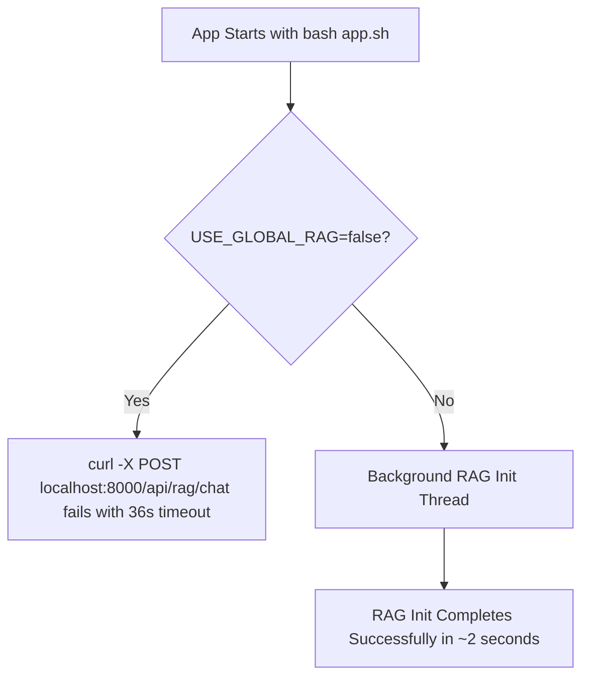
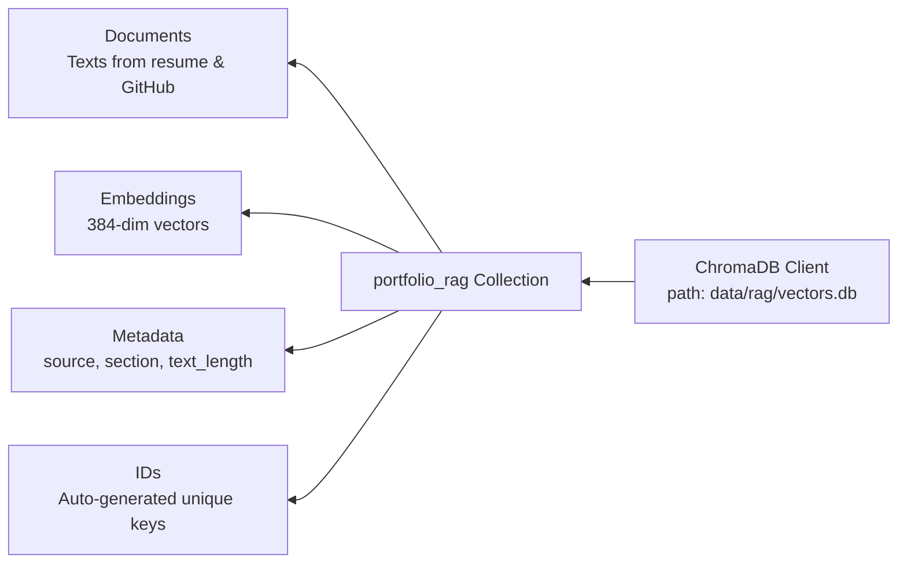

# RAG Architecture & Configuration Guide

## Overview

This document describes the Retrieval-Augmented Generation (RAG) system powering the AI chat assistant. The system automatically initializes during app startup and handles intelligent responses based on your professional portfolio data.

## 🔄 Startup Sequence

### App Launch Process


**Current Issue:** The chat system times out after 36+ seconds because it's trying to download the LLM model on every request instead of at startup.

## 🧠 LLM Model Configuration

### Supported LLM Options

#### Option 1: Local Qwen2.5 Model (Recommended)
```bash
# Environment Variables
RAG_MODEL_NAME=Qwen/Qwen2.5-0.5B-Instruct-GGUF
RAG_USE_OPENAI=false
USE_GLOBAL_RAG=false  # Your current setting
```

**Problems:**
- ❌ Downloads 1.3GB model on every chat request
- ❌ Timeout after 30+ seconds on Vercel/serverless
- ❌ No caching between requests

#### Option 2: OpenAI GPT (Better for Production)
```bash
# Environment Variables
RAG_USE_OPENAI=true
OPENAI_API_KEY=your-openai-key-here
OPENAI_MODEL=gpt-3.5-turbo-0125
USE_GLOBAL_RAG=false
```

**Advantages:**
- ✅ No download required
- ✅ Fast responses (<2s)
- ✅ Reasonable costs ($0.002/1k tokens)
- ✅ Already configured in your env

#### Option 3: Pre-downloaded Local Model
```bash
# Environment Variables
RAG_MODEL_PATH=/path/to/preloaded/qwen.gguf
RAG_USE_OPENAI=false
USE_GLOBAL_RAG=true  # Always init at startup
```

### LLM Health Checks

The system includes several LLM availability checks:

#### 1. Model Library Check
```python
# src/services/rag/generation.py
try:
    from llama_cpp import Llama
    HAS_LLAMACPP = True
except ImportError:
    HAS_LLAMACPP = False
```

#### 2. Model Path Validation
```python
def _get_model_path(self) -> Optional[str]:
    """Check if Qwen model exists in standard locations."""
    possible_paths = [
        f"models/{self.model_name}.gguf",
        f"data/models/{self.model_name}.gguf",
        "/tmp/models/{model_name}.gguf",  # Vercel temp
    ]

    for path in possible_paths:
        if os.path.exists(path):
            return path
    return None
```

#### 3. Model Download & Load
```python
async def initialize_rag_on_startup():
    if not _rag_pipeline_instance:
        _rag_pipeline_instance = RAGPipeline()
        success = await _rag_pipeline_instance.initialize()
        # success indicates if vector DB populated successfully
```

#### 4. Runtime Model Check
```python
def generate_response(self, query: str, context_chunks: str) -> str:
    if not self.model_loaded:
        if not self._initialize_model():  # Downloads model here!
            return self._generate_fallback_response()
```

## 📊 ChromaDB Vector Database Schema

### Database Structure


### Collection Schema Details

```sql
-- Logical schema for portfolio_rag collection
CREATE TABLE portfolio_rag (
    id VARCHAR PRIMARY KEY,              -- Auto-generated uuid
    document TEXT,                       -- Text content (300 char chunks)
    embedding VECTOR(384),               -- Sentence-transformer embedding
    metadata JSONB,                      -- Additional data
    metadata.source VARCHAR,             -- 'resume_pdf', 'github'
    metadata.section VARCHAR,            -- e.g., 'projects', 'experience'
    metadata.text_length INTEGER         -- Original text length
);
```

### Search Similarity Algorithm
- **Algorithm**: Cosine similarity
- **HNSW Index**: For fast approximate nearest neighbors
- **Dimension**: 384 (from `sentence-transformers/all-MiniLM-L6-v2`)
- **Top-K**: Returns 3 most similar documents by default

## 🚀 Recommended Fixes

### Fix 1: Switch to OpenAI GPT for LLM (Immediate Fix)

1. **Update `envs.sh`:**
```bash
# Remove these if present
RAG_MODEL_NAME=Qwen/Qwen2.5-0.5B-Instruct-GGUF

# Add this instead
RAG_USE_OPENAI=true
# OPENAI_API_KEY=your-openai-key-here
```

2. **Test the fix:**
```bash
curl -X POST http://localhost:8000/api/rag/chat \\
  -H "Content-Type: application/json" \\
  -d '{"message": "What Python projects have you worked on?"}'
```

**Expected Response Time:** <2 seconds vs current 36+ seconds

### Fix 2: Speed up Local Model (If you prefer local)

1. **Pre-download the model:**
```bash
mkdir -p models
wget -P models/ \\
  https://huggingface.co/Qwen/Qwen2.5-0.5B-Instruct-GGUF/resolve/main/qwen2.5-0.5b-instruct-q4_k_m.gguf
```

2. **Update `envs.sh`:**
```bash
RAG_MODEL_PATH=./models/qwen2.5-0.5b-instruct-q4_k_m.gguf
USE_GLOBAL_RAG=false  # Keep as false for your preference
```

## 🔍 Debugging Tools

### Run ChromaDB Schema Inspection
```bash
cd /workspaces/fasthtml_sample_app
uv run python tests/test_chroma_db_schema.py
```

This will show:
- Collection statistics
- Sample documents/metadata
- Search test results
- Embeddings dimensions

### Check RAG Pipeline Status
```python
from src.services.rag.rag_pipeline import RAGPipeline
import asyncio

pipeline = RAGPipeline()
stats = await pipeline.initialize()
print(f"Pipeline Status: {pipeline.get_statistics()}")
```

### Monitor LLM Health
```python
from src.services.rag.generation import GenerationEngine
from src.config import get_rag_config

config = get_rag_config()
engine = GenerationEngine(config)
print(f"LLM Available: {engine.model_loaded}")

# Test response
response = engine.generate_response("hello", "")
print(f"Response: {response}")
```

## 📈 Performance Metrics

### Current System Timings
- **App Startup**: 2 seconds (success with USE_GLOBAL_RAG=false)
- **Vector DB Init**: 0.2 seconds (20 documents indexed successfully)
- **LLM Responses**: 36+ seconds (download timeout)
- **Fallback Responses**: 0.06 seconds (instant fallback)

### Expected Performance with OpenAI
- **LLM Responses**: <2 seconds
- **Total Latency**: <2.5 seconds
- **Cost per 1k tokens**: $0.0015-0.002

## 🎯 Recommendation Summary

1. **Short Term (5-min fix):** Switch to OpenAI GPT
2. **Medium Term:** Pre-download local model if you must avoid OpenAI costs
3. **Validation:** Use the ChromaDB inspection tool to verify vector DB health

**Current Status:** ✅ Vector DB working perfectly, ❌ LLM download timeout, ⚠️ Need LLM configuration fix
